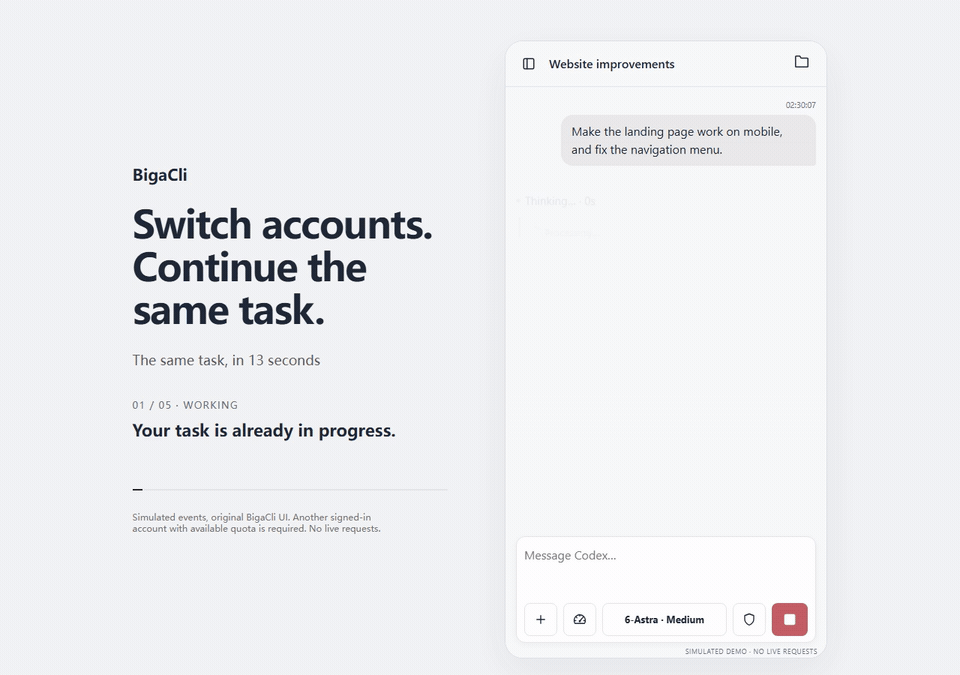
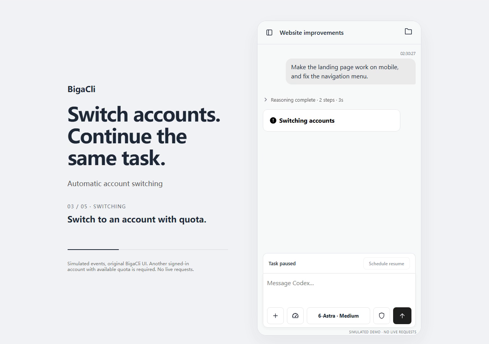
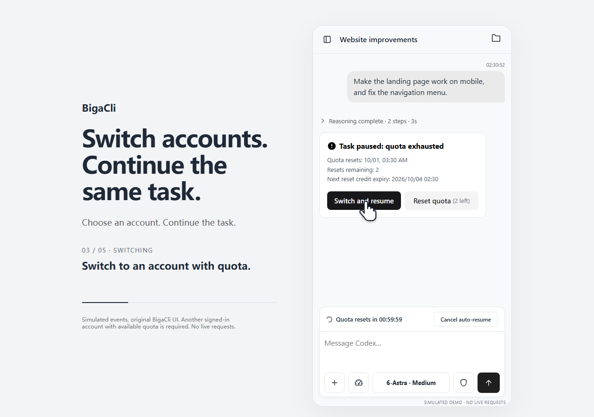

# BigaCli

[English](README.md) · [简体中文](README.zh-CN.md) · **日本語**

### アカウントを切り替えて、同じタスクを続ける。

スマートフォンで使える Codex ワークスペース。会話を保ったまま、利用枠が残っている別のログイン済みアカウントで作業を続けられます。

[](https://github.com/enzwklsb/BigaCli/releases/latest)
[](https://www.npmjs.com/package/bigacli)
[](LICENSE)

**[Windows 版をダウンロード](https://github.com/enzwklsb/BigaCli/releases/latest) · [デモを見る](https://enzwklsb.github.io/BigaCli/?lang=ja) · [使い始める](#quick-start)**

[](https://enzwklsb.github.io/BigaCli/?lang=ja#brief)

*実際の UI を使用したシミュレーションです。実際の利用枠は消費しません。切り替えには、ログイン済みで利用枠が残っており、現在のモデルに対応する別のアカウントが必要です。動画の表示言語は英語です。*

| 自動切り替え · 17 秒 | 手動選択 · 23 秒 |
| --- | --- |
| [](https://enzwklsb.github.io/BigaCli/?lang=ja#auto) | [](https://enzwklsb.github.io/BigaCli/?lang=ja#manual) |
| 利用上限に達すると、条件を満たすアカウントを自動で選び、元のタスクを続けます。 | アカウントの選択、切り替えの確認、タスク再開までを順に確認できます。 |

```powershell
npm i -g bigacli
bigacli start
```

Windows x64、Node.js 22 以降が必要です。実行環境を同梱した ZIP 版をダウンロードし、展開して `start.cmd` を実行することもできます。

## BigaCli を使う理由

| 同じタスクを続ける | スマートフォンで作業 | 待機中も準備を進める |
| --- | --- | --- |
| 会話のコンテキストを保ってアカウントを切り替え。 | 利用枠の確認、切り替え、ファイルのプレビューとダウンロード。 | 追加メッセージをキューに入れて編集し、利用枠の回復後に再開。 |

BigaCli は [CloudCLI](https://github.com/siteboon/claudecodeui) をベースとした Codex Web クライアントです。作業は自分のパソコン上で実行し、スマートフォンのブラウザーから操作できます。

以下は現在のリポジトリの機能説明です。古いリリースには含まれない機能があります。

## 主な機能

1. **複数アカウント間で作業を継続。** 個別にログインした Codex アカウントを管理し、同じ会話でタスクを再開できます。コンテキストを手動でコピーする必要はありません。
2. **利用上限からの復帰。** 条件を満たすアカウントへ自動切り替えするか、利用枠の回復を待って再開します。複数の停止中の会話にも対応し、待機中も入力やキューへの追加が可能です。
3. **簡潔で目的に沿った回答。** 既定の指示は結果を先に伝え、必要十分な変更でタスクを完了することを重視します。簡潔な回答の設定で詳しさを調整できます。
4. **モバイルでファイルを確認・取得。** 画像、PDF、HTML、Markdown、テキストなどをプレビューし、会話のファイル一覧から成果物をダウンロードできます。
5. **スマートフォンとパソコンで共通の作業場所。** 同じサービスに接続して会話とタスク状態を共有します。パソコンとネットワークが利用可能なら URL を開き直すだけで、アプリ上のペアリングを繰り返す必要はありません。
6. **編集できるメッセージキュー。** 作業中に即時送信かキュー送信を選べます。各メッセージの確認、編集、削除、個別の即時送信が可能で、編集中は自動送信を待機します。
7. **スマートフォンから利用枠をリセット。** リセット可能回数と有効期限を確認し、確認操作後に実行できます。利用可否はアカウントによって異なり、画面を開くだけでは回数を消費しません。
8. **時刻と処理時間の表示。** メッセージの時刻、処理状況、取得できた所要時間を確認できます。
9. **入力・添付ファイルの下書き保存。** アップロードや貼り付けに対応し、ページを更新してもテキストと保存済みの送信待ち添付を復元できます。

<a id="quick-start"></a>

## 起動とスマートフォン接続

**Windows x64** に対応しています。ZIP と npm のいずれかを選んでください。

**ZIP：** [最新リリース](https://github.com/enzwklsb/BigaCli/releases/latest)から **BigaCli-win-x64.zip** をダウンロードし、書き込み可能なフォルダーに展開して `start.cmd` を実行します。Node.js の別途インストールは不要です。

**npm：** Node.js 22 以降と npm をインストールし、次を実行します。

```powershell
npm i -g bigacli
bigacli start
```

初回の `bigacli start` は GitHub から対応する完全版をダウンロードし、SHA-256 を検証して `%LOCALAPPDATA%\BigaCli` にインストールします。初回は GitHub へのアクセスとプログラム全体のダウンロードが必要です。次回からはインストール済みのプログラムを起動します。npm パッケージは起動用コマンドのみを提供し、認証情報を含まず、npm インストール時にはアプリをダウンロードしません。

コマンド：`bigacli start` で起動、`bigacli --help` / `-h` でヘルプ、`bigacli --version` / `-v` で npm ランチャーのバージョンを表示します。引数なしの `bigacli` でも起動できます。

パソコンで `http://localhost:3101` を開き、自分の Codex アカウントを追加してプロジェクトと会話を選びます。配布パッケージにログイン情報は含まれません。

**どちらも「設定 → 更新を確認」から更新します。** 更新は実行中のタスクが終了するまで待ち、表示言語に応じた更新内容を表示します。npm 版も同じ更新機能を使うため、毎回 npm を再インストールする必要はありません。ランチャー自体を更新するときだけ `npm i -g bigacli@latest` を実行してください。アプリ本体のバージョンは設定画面で確認します。npm ランチャーを削除しても、別途インストールされた本体、アカウント、会話データは削除されません。

既存の ZIP 版はそのまま使えます。ZIP 版と npm 版のインストール先は自動移行・統合されません。その他のコンポーネント ZIP、`release.json`、チェックサムはインストーラーと更新機能が使用します。

**BigaCli 自体にネットワークトンネル機能はありません。異なるネットワークからの接続には、ご自身の [Tailscale](https://tailscale.com/download) 環境をご利用ください。** 作者のネットワークに参加する必要や、作者の接続サーバーへの依存はありません。

- 同一 LAN：スマートフォンで `http://パソコンのLAN-IP:3101` を開きます。
- 異なるネットワーク：両端末に Tailscale をインストールし、同じアカウントで接続して `http://パソコンのTailscale-IP:3101` を開きます。
- パソコンは電源・ネットワーク・BigaCli を維持し、待ち受け設定とファイアウォールで接続を許可してください。

BigaCli のページには現在、独立した Web ログイン認証はありません。サービスに接続できる端末は操作できます。信頼できる LAN またはプライベートな Tailscale ネットワークで使用し、3101 ポートを直接インターネットに公開しないでください。Codex アカウントの認証はこれとは別です。

## 画面の操作ガイド

| 場所 | 用途 |
| --- | --- |
| 左上のメニュー | サイドバーでプロジェクトのワークツリーと最近の会話を表示。 |
| サイドバー上部の検索 | プロジェクト、会話、メッセージ本文を検索。 |
| ワークツリー一覧の「新規」 | ワークツリーを作成。プロジェクト内の「新しい会話」でセッションを開始。 |
| 会話の三点メニュー | 名前変更、Codex セッション ID のコピー、分岐、アーカイブ、完全削除。 |
| サイドバー下部のアカウント領域 | アカウント画面または設定を開く。 |
| **右上のフォルダー** | **現在の会話で作成・参照したファイルの一覧**を表示し、名前や形式で検索、プレビュー、ダウンロード。パソコン全体のファイル管理画面ではありません。 |
| メッセージのファイルカード・画像 | 添付をプレビューし、上部のダウンロード操作で保存。 |
| 入力欄の「＋」 | 画像やファイルを追加。クリップボードからの貼り付けにも対応。 |
| 入力欄のメーター | 利用枠、回復時刻、リセット回数・期限を確認し、リセットやアカウント選択へ移動。 |
| 入力欄のモデル名 | アカウントが対応するモデル、思考レベル、高速モードを選択。 |
| 盾・警告アイコン | 既定・編集・制限なしの権限を選択。制限なしでは赤い警告アイコンを表示。 |
| 送信・停止 | タスクの送信または停止。実行中はキューか即時送信を選択。 |
| 入力欄内のキュー | 各メッセージの先頭行を表示。クリックで編集、再クリックまたは外側で閉じ、× で削除。3 行を超えるとスクロール。 |
| 利用枠回復バー | 再開までの時間を確認・キャンセルし、キャンセル後は再予約。 |
| 利用枠上限のカード | 回復・リセット情報を確認し、切り替えて再開、または利用枠をリセット。 |
| 設定 → 問題を報告 | GitHub ログインなしで送信。失敗時は入力を保持し、報告はメンテナーの非公開リストへ届きます。 |

## 日常の使い方

### アカウントと利用枠の回復

アカウント画面で追加・選択・削除できます。利用枠パネルからも同じ画面を開けます。実行中のタスクのアカウント環境は変更できません。

通常のアカウント選択は選択先を変えるだけで、中断タスクを自動再開しません。上限到達カードから「切り替えて再開」を使ってください。自動切り替えを有効にすると、現在のモデルと思考レベルに対応し、条件を満たすアカウントを選びます。

利用可能なアカウントがない場合は、既定で利用枠の回復を待ちます。一覧には最も早く回復する候補を表示し、別の待機先も選べます。回復時刻の 1 分後に再開を予約し、利用枠を再確認します。いつでもキャンセルでき、待機中も入力欄は利用できます。

5 時間・7 日間のいずれかの枠を使い切ると、そのアカウントで続行できません。正常な応答に 5 時間枠が含まれない場合は「無制限」、取得失敗や異常は「不明」と表示します。リセットには確認操作が必要です。

### キューと即時送信

キューは現在のタスク終了後に送信されます。複数のキューは一つの追加メッセージにまとめ、最初の項目に保存されたモデルと思考レベルを使います。その後の設定変更は次の新規送信に適用します。

プレビューを開くだけではキーボードを表示しません。編集は即時保存され、編集画面が開いている間は自動送信を待ちます。編集画面の「今すぐ送信」はその項目だけを送信し、他の項目は残します。利用枠回復の待機中は即時送信できませんが、キューへの追加は可能です。

利用枠回復後は中断タスクを先に続行し、完了後に訂正や追加指示を含むキューを送信します。手動停止後も、利用枠などの送信条件を満たせば残ったキューを送信できます。

### ファイル・下書き・設定

送信前の添付の × は下書きからの削除です。送信済みファイルのプレビューとは別の操作です。更新後の下書き復元は、未送信内容の端末間リアルタイム同期を意味しません。

プレビュー可否はファイル形式によります。非対応のファイルもダウンロードできます。プレビュー、ダウンロード、会話ファイル一覧はパソコンとスマートフォンの両方で使えます。

アプリは簡体中文、English、日本語とダークモードに対応しています。表示言語は UI の文言を変更し、Agent の回答言語を強制しません。回答言語は会話内で指定できます。

簡潔な回答の設定は次の送信から適用され、アカウント切り替え後も維持します。思考要約・ツール詳細の設定は表示だけを変更します。バージョンと更新操作は設定画面にあります。

## リポジトリ構成

| パス | 役割 |
| --- | --- |
| `AGENTS.md` | 協業、変更、配布のルール。コード変更前に確認してください。 |
| `ui/index.html` | メイン UI、ダイアログ、入力、キュー、アカウントと利用枠。 |
| `ui/locales.json`、`ui/i18n.js` | 中英日の文言と表示言語の切り替え。 |
| `ui/preview-ui.js`、`ui/vendor/` | ファイルプレビューの処理と依存ライブラリー。 |
| `custom/server/modules/providers/` | Codex 実行、アカウント分離、切り替え、利用枠、中断復帰。 |
| `custom/server/modules/scheduled-messages/` | キューとスケジュール。 |
| `custom/server/modules/websocket/` | リアルタイムメッセージと端末間の購読。 |
| `feedback/` | Cloudflare Worker の報告 API、D1 スキーマと手順。`feedback/SETUP_CN.md` を参照。 |
| `cloudcli/` | バージョン固定の上流ソース。 |
| `scripts/` | ビルド、検証、配布スクリプト。 |
| `bin/bigacli.cjs`、`npm/install.cjs` | npm の起動、初回ダウンロード・検証・インストール。 |
| `releases/update-notes.json` | 手書きの中英日リリースノート。 |
| `docs/index.html`、`docs/site.js`、`docs/media/` | 公開デモページ、言語切り替え、動画。 |

スマートフォン接続は利用者自身のネットワークを使います。フィードバック受付は別のサービスです。独自に運用する場合は送信先を自分のエンドポイントに変更してください。

## ビルドとリリース

リリースビルドは Windows x64、Node.js 24.19.0 を使用します。`cloudcli/` で `npm ci`、`npm run build` を実行し、ルートで `node scripts/build.mjs`、続いて `scripts/package.ps1 -NodeDirectory <node.exeのディレクトリ>` を実行します。パッケージ作成時の PATH にその Node と npm が必要です。

`release.json` は本体と上流のバージョンを固定し、`cloudcli/package-lock.json` は依存関係を記録します。ビルドは上流をコンパイルしてからカスタムモジュールを元の配置先へコピーします。変更は `custom/server/` と `ui/` などのソースで管理し、インストール済みリリースに直接パッチを当てないでください。

`nodeArchive` は公開済み Node コンポーネントの URL と SHA-256 を固定します。Node が同じなら既存アーカイブを再利用し、圧縮ツールの差で不要な再ダウンロードが発生するのを防ぎます。Node を変える場合は新コンポーネントを作成・公開して参照を更新します。ロックファイルが変わっていないローカル再ビルドでは `-ReuseDependencies` を使えます。

リリースワークフローは**下書き**を作成します。検証後に公開すると利用者が更新できます。本体、依存関係、Node は独立した完全な ZIP で、一つのマニフェストが検証済みの組み合わせを選びます。中間バージョンの逐次適用は不要です。

npm 公開時はルートの `package.json`、`release.json`、`releases/update-notes.json` のバージョンを揃えます。`npm pack --pack-destination build` で小さなランチャーパッケージを作成します。許可リストはアプリソース、ビルド成果物、利用者データを除外します。**完全版 Windows ZIP と SHA256SUMS.txt を含む GitHub リリースを先に公開**し、その後、認証済みの npm アカウントで検証済み tarball を `npm publish build/bigacli-<version>.tgz` で公開します。npm を先行公開しないでください。ルート npm パッケージには本番依存関係やインストールスクリプトはありません。

本体のみの更新は `-ComponentsOnly -ReuseDependencies` で作成し、変更のないコンポーネントを新しい版の assets から再利用できます。完全インストール ZIP は再作成しません。ダウンロード先は `<install>/downloads`、展開済みコンポーネントは `<install>/store` で、一時 ZIP は削除されます。

## データとライセンス

認証情報、個人データベース、会話履歴をリポジトリや配布物に入れないでください。既定の Codex Home は既存の `.codex` を使い、追加アカウントの Home は分離します。更新時にデータを維持できるよう、既存の CloudCLI データベースとアカウントストアの保存先を使用します。

[CloudCLI](https://github.com/siteboon/claudecodeui) をベースとし、**AGPL-3.0-or-later** に従います。BigaCli の変更も同じライセンスで公開します。対応するソースとビルドスクリプトは各リリースタグにあります。上流の表示は `cloudcli/NOTICE` に、同梱の第三者パッケージのライセンスは各パッケージに保持します。本ソフトウェアは無保証で提供されます。
